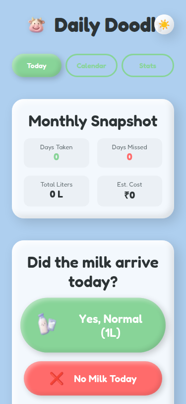
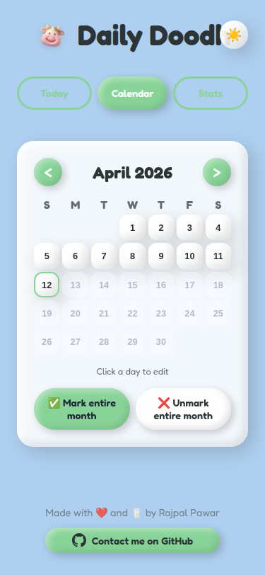
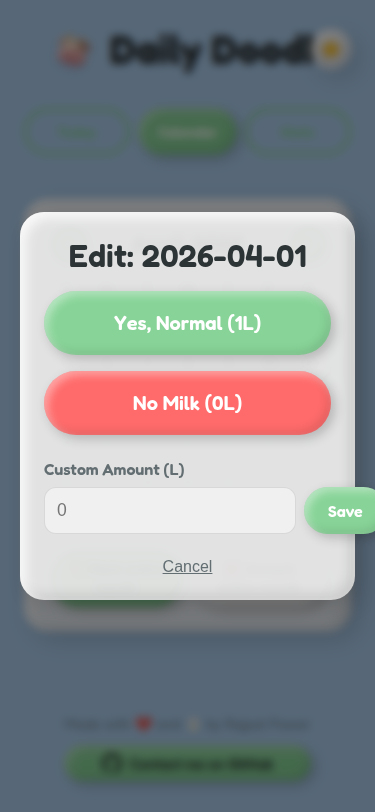
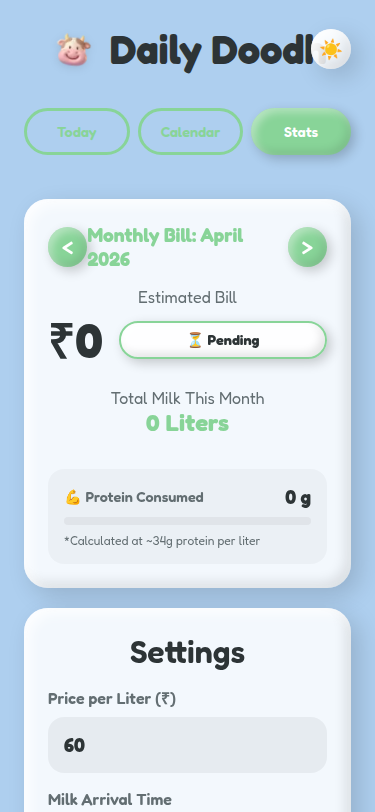
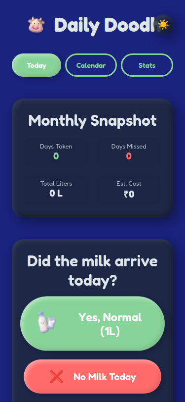
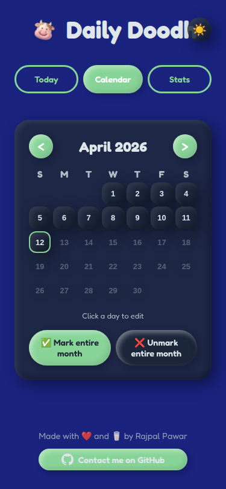
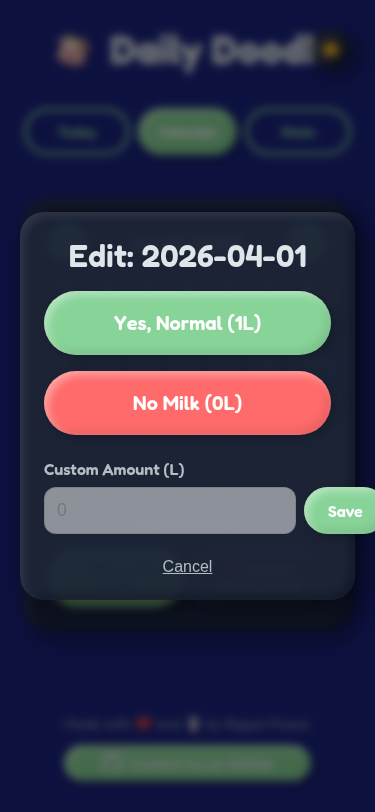
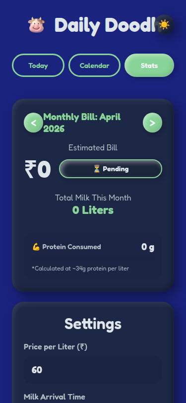

# Daily Doodh 🥛

**Daily Doodh** is a personal milk tracking application designed to help you keep track of your daily milk delivery, calculate monthly bills,and keep the record of transactions and view consumption statistics. It features a unique, modern Claymorphism design aesthetic that makes tracking fun and visually appealing.

## Features

- **📅 Daily Logging**: Easily mark if milk arrived (Yes/No) with default or custom amounts for each day.
- **🗓️ Calendar View**: A visual monthly calendar to see your history at a glance and edit past entries.
- **📊 Stats Dashboard**: Get insights with monthly snapshots, including:
  - Days milk was taken vs. missed.
  - Total liters consumed.
  - Estimated monthly cost based on your set price.
- **🔔 Smart Reminders**: Browser notifications remind you to log your milk status at your preferred time.
- **🎨 Visuals & Themes**:
  - Beautiful **Claymorphism** UI design.
  - **Light & Dark Mode** support.
  - **English & Hindi** language support.
  - Fun animations and interactive elements.
- **⚙️ Customizable Settings**:
  - Set your milk price per liter (₹).
  - Set a default daily amount (e.g., 1L).
  - Configure notification delivery times.
- **💾 Local Storage**: All your data is stored securely in your browser's local storage—no account or internet required!

## Tech Stack

This project is built with modern web technologies:

- [Next.js 14](https://nextjs.org/) (App Router)
- [React 18](https://react.dev/)
- [TypeScript](https://www.typescriptlang.org/)
- CSS Modules & Vanilla CSS (for Claymorphism effects)

## Screenshots

### Light Mode

| Home View | Calendar View | Edit Entry | Stats & Settings |
|:---:|:---:|:---:|:---:|
|  |  |  |  |

### Dark Mode

| Home View | Calendar View | Edit Entry | Stats & Settings |
|:---:|:---:|:---:|:---:|
|  |  |  |  |
